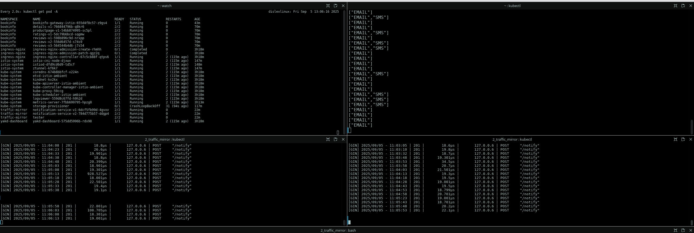
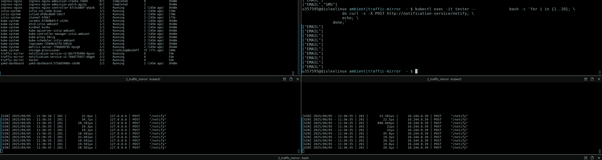
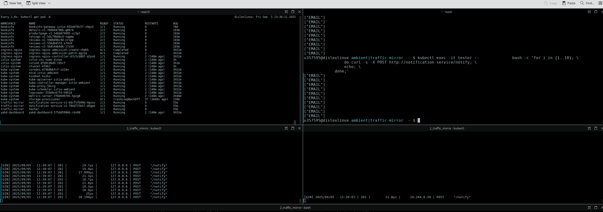

#SETUP istio
<!-- curl -L https://istio.io/downloadIstio | ISTIO_VERSION=1.25.1 sh -
export PATH="$PATH:/root/istio-1.25.1/bin"
istioctl install --set profile=demo -y -->

Prereq: installazione gateway-api e istio ambient

```bash
kubectl get crd gateways.gateway.networking.k8s.io &> /dev/null || kubectl apply -f manifests/gateway-api-1.3.0-install.yaml
istioctl install --set profile=ambient --skip-confirmation
```

preparo applicazione

```bash
kubectl create namespace traffic-mirror
kubectl label namespace traffic-mirror istio-injection=enabled
kubectl config set-context --current --namespace=traffic-mirror

#requisiti
#cd B_Traffic_managment/2_traffic_mirror
kubectl apply -f 1_setupenv.yaml -n traffic-mirror
kubectl run tester --image=nginx
```

abbiamo 2 servizi notification uno che notifica via email e l'altro che notifica via mail ed sms

```bash
kubectl get po,svc -L app,version
```

Il servizio  kube punta ad entrambe (labels app=notification-service). facendo questa chiamate risponderanno al 50% una e al 50% l'altra (NO istio)

```bash
kubectl exec -it tester -- \
             bash -c 'for i in {1..20}; \
                 do curl -s -X POST http://notification-service/notify; \
                 echo; \
                 sleep 1
             done;'
```

```log
["EMAIL","SMS"]
["EMAIL"]
["EMAIL"]
["EMAIL"]
["EMAIL"]
```

**nota:**  
- log ["EMAIL"]       --> notification-service-v1
- log ["EMAIL","SMS"] --> notification-service-v2

SHELL


Qui ho messo nel riquadro in altro a dx il comando:

```bash
kubectl exec -it tester --              bash -c 'for i in {1..200000}; \
                 do curl -s -X POST http://notification-service/notify; \
                 echo; \
                 sleep 5
             done;'
```

Nei due sotto i log delle applicazioni


```bash
kubectl logs $(kubectl get pods -o name -l app=notification-service,version=v1) -f
kubectl logs $(kubectl get pods -o name -l app=notification-service,version=v2) -f
```

Abilitiamo ISTIO

creiamo una destinationrule che punta alle due applicazioni, le definisco ma non ne cambio il comportamento

```yaml
apiVersion: networking.istio.io/v1alpha3
kind: DestinationRule
metadata:
  name: notification
spec:
  host: notification-service
  subsets:
  - name: v1
    labels:  ---> questa è la label della deploy
      version: v1 
  - name: v2
    labels:
      version: v2
```

```bash
kubectl apply -f 2_destinationrule.yaml
```

Ora aggiungendo il virtual service cambio il comportamento. 

Con questo invio il 100% del traffico al subset v1 e gli diciamo di mirrorare il 100% del traffico al subset v2, le risposte del subset v2 vengono scartate.

```yaml
apiVersion: networking.istio.io/v1beta1
kind: VirtualService
metadata:
 name: notification
spec:
  hosts:
  - notification-service
  http:
  - route:
    - destination:
        host: notification-service
        subset: v1
    mirror:
      host: notification-service
      subset: v2
    mirrorPercentage:
      value: 100
```

```bash
kubectl apply -f 3_virtualservice.yaml
```

Generiamo nuovamente delle chiamate, vedremo che e stata chiamata solo l'applicazione v1

```bash
kubectl exec -it tester -- \
             bash -c 'for i in {1..10}; \
                 do curl -s -X POST http://notification-service/notify; \
                 echo; \
             done;'
```

ma se andiamo a vedere i log vedremo che le chiamate sono arrivate ad entrambe

```bash
kubectl logs $(kubectl get pods -o name -l app=notification-service,version=v1)
kubectl logs $(kubectl get pods -o name -l app=notification-service,version=v2)
```




Ora mistiamo il mirror al 10% su secondo subset

```yaml
apiVersion: networking.istio.io/v1beta1
kind: VirtualService
metadata:
 name: notification
spec:
  hosts:
  - notification-service
  http:
  - route:
    - destination:
        host: notification-service
        subset: v1
    mirror:
      host: notification-service
      subset: v2
    mirrorPercentage:
      value: 10
```

```bash
kubectl apply -f 4_virtualservice.yaml
```

Generiamo nuovamente delle chiamate

```bash
kubectl exec -it tester -- \
             bash -c 'for i in {1..10}; \
                 do curl -s -X POST http://notification-service/notify; \
                 echo; \
             done;'
```

Se andiamo a vedere i log vedremo che le chiamate sono arrivate ad entrambe ma la seconda applicazione ne ha ricevuta una

```bash
kubectl logs $(kubectl get pods -o name -l app=notification-service,version=v1)
kubectl logs $(kubectl get pods -o name -l app=notification-service,version=v2)
```


