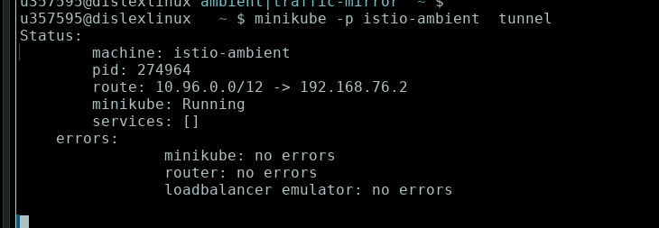

# uso gateway api per esporre applicazione


```bash
kubectl get crd gateways.gateway.networking.k8s.io &> /dev/null || kubectl apply -f manifests/gateway-api-1.3.0-install.yaml
istioctl install --set profile=ambient --skip-confirmation
```

```bash
kubectl run tester --image=nginx
cd ~/corso-istio/D2_Gateway_Ambient_conco/1_conco
```
Preparo ns applicazione

```bash
ns=ambient-gateway-test
kubectl create namespace ${ns}
kubectl label namespace ${ns} istio-injection=enabled
kubectl config set-context --current --namespace=${ns}
```

creo l'applicazione e config di gateway api

```bash
kubectl apply -f 1_setupenv.yaml
kubectl apply -f 2_gateway-api.yaml
```

provo ad usare minikube tunnel

```bash
minikube -p istio-ambient  tunnel
```




Devo creare il virtualservice

```bash
kubectl apply -f 3_virtualservice.yaml
```

bookinfo-gateway


Cambio i tipo di service in modo da poter far il forward

```bash
kubectl annotate gateway bookinfo-gateway networking.istio.io/service-type=ClusterIP
kubectl port-forward svc/bookinfo-gateway-istio 8080:80 -n bookinfo
```

Accedo con http://localhost:8080/productpage 


```bash
curl http://booking.example.com:${istio_port}/bookings
```


