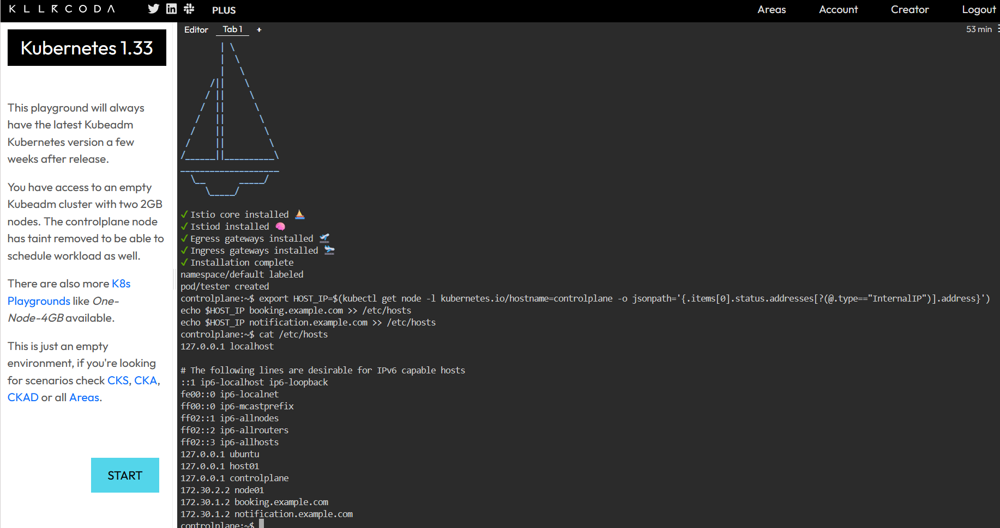
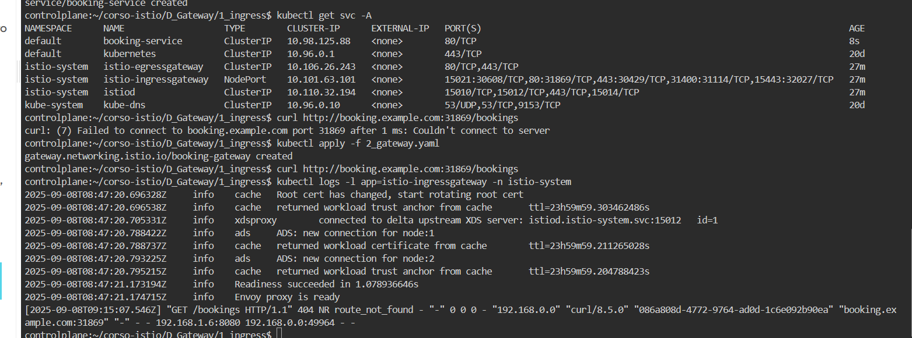

```bash
curl -L https://istio.io/downloadIstio | ISTIO_VERSION=1.25.1 sh -
export PATH="$PATH:/root/istio-1.25.1/bin"
istioctl install --set profile=demo --set components.ingressGateways[0].k8s.service.type=NodePort --set components.ingressGateways[0].name=istio-ingressgateway -y
kubectl label namespace default istio-injection=enabled
kubectl run tester --image=nginx
git clone https://github.com/alekonko/corso-istio.git
cd ~/corso-istio/D_Gateway/1_ingress
```

inserisco il file host per poter raggiungere la mia app dall'ingress gateway

```bash
export HOST_IP=$(kubectl get node -l kubernetes.io/hostname=controlplane -o jsonpath='{.items[0].status.addresses[?(@.type=="InternalIP")].address}')
echo $HOST_IP booking.example.com >> /etc/hosts
echo $HOST_IP notification.example.com >> /etc/hosts
```




creo l'applicazione 

```bash
kubectl apply -f 1_setupenv.yaml
```

prendo la porta nodeport e la chiamo con il nome della mia applicazione

```bash
#kubectl get svc -A
istio_port=$(kubectl get svc -n istio-system istio-ingressgateway -o yaml | yq '.spec.ports[] | select(.name == "http2") | .nodePort')
# va bene pure cosi'
#kubectl get svc -n istio-system istio-ingressgateway -o yaml | awk '/- name: http2/{flag=1} flag && /nodePort:/ {print $2; exit}'
```

prendo il numero di porta mappata sulla porta 80 del pod istio-ingressgateway

```bash
curl http://booking.example.com:${istio_port}/bookings
```

Non va in quanto manca il gateway per andare dentro il namespace dell'applicazione

Creo il gateway

```yaml
apiVersion: networking.istio.io/v1alpha3
kind: Gateway
metadata:
  name: booking-gateway
spec:
  selector:
    istio: ingressgateway
  servers:
  - name: booking
    port:
      number: 80
      name: http
      protocol: HTTP
    hosts:
    - "booking.example.com"
```

```bash
kubectl apply -f 2_gateway.yaml
curl http://booking.example.com:${istio_port}/bookings
```

Non avro piu errore, entro nel ns in quanto ho si il gw ma si ferma sull'ingress fw in quanto  ma nemmeno una risposta vediamo nei log dell'ingress gateway

```bash
kubectl logs -l app=istio-ingressgateway -n istio-system
```




Devo creare il virtualservice

```bash
kubectl apply -f 3_virtualservice.yaml
```

OK :)

```bash
curl http://booking.example.com:${istio_port}/bookings
```

Potrei avere una porta fissa per esempio la 30000 ma per fare questo ho bisogno di altri parametri da passare al setup di istioctl

```bash
istioctl install \
  --set profile=demo \
  --set components.ingressGateways[0].k8s.service.type=NodePort \
  --set components.ingressGateways[0].name=istio-ingressgateway \
  --set "components.ingressGateways[0].k8s.service.ports[0].name=http2" \
  --set "components.ingressGateways[0].k8s.service.ports[0].port=80" \
  --set "components.ingressGateways[0].k8s.service.ports[0].targetPort=8080" \
  --set "components.ingressGateways[0].k8s.service.ports[0].nodePort=30000" \
  --set "components.ingressGateways[0].k8s.service.ports[1].name=https" \
  --set "components.ingressGateways[0].k8s.service.ports[1].port=443" \
  --set "components.ingressGateways[0].k8s.service.ports[1].targetPort=8443" \
  --set "components.ingressGateways[0].k8s.service.ports[1].nodePort=30001" \
  -y
```

test

```bash
curl http://booking.example.com:30000/bookings
```

istioctl install -f istio.yaml -y

```bash
apiVersion: install.istio.io/v1alpha1
kind: IstioOperator
metadata:
  name: istio-control-plane
spec:
  profile: demo
  components:
    ingressGateways:
      - name: istio-ingressgateway
        enabled: true
        k8s:
          service:
            type: NodePort
            ports:
              - name: http2
                port: 80
                targetPort: 8080
                nodePort: 30000
              - name: https
                port: 443
                targetPort: 8443
                nodePort: 30001
```