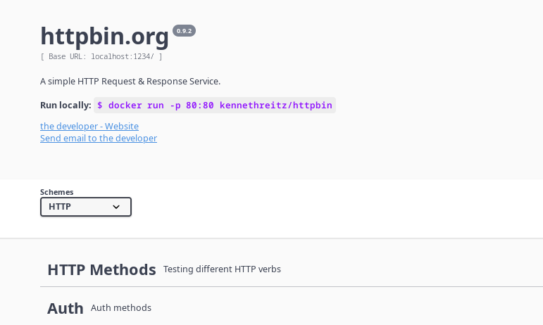

# JWT Policy

## Prereq: installazione minikube sidecar

Script installazione automatico, io skippo primo pezzo, uso 1.27.1

```bash
curl -L https://istio.io/downloadIstio | ISTIO_VERSION=1.25.1 sh -
export PATH="$PATH:/root/istio-1.25.1/bin"
istioctl install --set profile=demo -y
kubectl label namespace default istio-injection=enabled
```

## Deploy Applicazione

Setup ns, deployare l'applicazione httpbin, il gateway e il virtualservice


```bash
ns=jwt-test
kubectl create namespace ${ns}
kubectl label namespace ${ns} istio-injection=enabled
kubectl config set-context --current --namespace=${ns}
```


```bash
kubectl apply -f 1_setupenv.yaml
```

per minikube

```bash
kubectl patch svc istio-ingressgateway -n istio-system \
  -p '{
    "spec": {
      "type": "NodePort",
      "ports": [
        {"port":80,"targetPort":8080,"nodePort":32080,"protocol":"TCP","name":"http2"},
        {"port":443,"targetPort":8443,"nodePort":32443,"protocol":"TCP","name":"https"}
      ]
    }
  }'


myip=$(minikube -p istio ip)
ingressgw_ip=$(minikube -p istio ip)
```

per entrare dal ingressgw (con nodeport)

```bash
curl -H "Authorization: Bearer XXXXX"  http://${ingressgw_ip}:32080
```

per entrare dal ingressgw (con portforward),

```bash
kubectl port-forward -n istio-system --address 0.0.0.0 service/istio-ingressgateway 1234:80
```

```bash
curl http://localhost:1234
curl -H "Authorization: Bearer XXXXX"  http://localhost:1234
```




Impostiamo JWT authentication con AUTH0, vanno create risorse RequestAuthentication e AuthorizationPolicy

```yaml
apiVersion: security.istio.io/v1beta1
kind: RequestAuthentication
metadata:
  name: jwt-auth
spec:
  selector:
    matchLabels:
      app: my-api
  jwtRules:
  - issuer: "https://dev-srxcjo72n3try4vd.eu.auth0.com/"
    jwksUri: "https://dev-srxcjo72n3try4vd.eu.auth0.com/.well-known/jwks.json"
---
apiVersion: security.istio.io/v1beta1
kind: AuthorizationPolicy
metadata:
  name: require-jwt
spec:
  selector:
    matchLabels:
      app: my-api
  action: ALLOW
  rules:
  - from:
    - source:
        requestPrincipals: ["*"]
```


```bash
kubectl apply -f 2_jwt.yaml
```

se rifaccio la chiamata mi dara un errore di RBAC perche non gli sto passando il token

```bash
~/corso-istio/F_JWT (main) $ curl http://localhost:1234
RBAC: access denied
```

Se passo un header Authorization Bearer XXXXXXX, il check del token verifica che il token non è nel formato corretto

```bash
curl -H "Authorization: Bearer XXXXX"  http://localhost:1234
#o
#curl -H "Authorization: Bearer XXXXX"  http://${ingressgw_ip}:32080
```

```bash
#Jwt is not in the form of Header.Payload.Signature with two dots and 3 sections
```

Devo genereare prima il jwt con una chiamata curl opportuna che passo dopo alla chiamata vera e propria nell' header Authorization Bearer

```bash
echo " "
echo "### genero jwt"
echo " "
echo " "

jwt_currrent=$(curl --request POST \
  --url https://dev-rzkchlfkzqyo3c07.us.auth0.com/oauth/token \
  --header 'content-type: application/json' \
  --data '{
    "client_id":"xxxxxxxxxxxx",
    "client_secret":"xxxxxxxxxxxxxxxxxxx",
    "audience":"http://my-api/",
    "grant_type":"client_credentials"
  }')

token_type=$(echo "$jwt_currrent" | jq -r '.token_type')
access_token=$(echo "$jwt_currrent" | jq -r '.access_token')

echo jwt_current  : $jwt_currrent
echo access_token : $access_token
echo token_type   : $token_type
echo " "
echo " "
echo " "
# echo curl -H "\"Authorization: $token_type $access_token\"" "http://${ingressgw_ip}:32080"
# curl -H "Authorization: $token_type $access_token" "http://${ingressgw_ip}:32080"


echo curl -H "\"Authorization: $token_type $access_token\"" http://localhost:1234
curl -H "Authorization: $token_type $access_token" http://localhost:1234
echo ""
```

**NOTA**: non va, c'e' un problema nel validare il certificato di https://dev-srxcjo72n3try4vd.eu.auth0.com/.well-known/jwks.json

```bash
/jwt_debug.sh XXXXXXXXX_MY_ACCESS_TOKEN_XXXXXXXXXXXX
==> Pod ingressgateway: istio-ingressgateway-b6cd68585-lwf5q
==> Test JWKS dal pod...
000command terminated with exit code 60
```

entro nel pod dell'ingressgw:

```bash
kubectl exec -n istio-system -it istio-ingressgateway-b6cd68585-lwf5q --   bash
```

```bash
echo | openssl s_client -connect dev-rzkchlfkzqyo3c07.us.auth0.com:443 -showcerts
CONNECTED(00000003)
depth=0 CN = dev-rzkchlfkzqyo3c07.us.auth0.com
verify error:num=20:unable to get local issuer certificate
verify return:1
depth=0 CN = dev-rzkchlfkzqyo3c07.us.auth0.com
verify error:num=21:unable to verify the first certificate
verify return:1
depth=0 CN = dev-rzkchlfkzqyo3c07.us.auth0.com
verify return:1
---
Certificate chain
 0 s:CN = dev-rzkchlfkzqyo3c07.us.auth0.com
   i:O = EXAMPLE, L = AIEIE, ST = AIEIE, C = IT, CN = Zio Bambino
   a:PKEY: rsaEncryption, 2048 (bit); sigalg: RSA-SHA256
   v:NotBefore: Sep 14 21:38:16 2025 GMT; NotAfter: Sep 14 21:38:16 2026 GMT
-----BEGIN CERTIFICATE-----
XXXXXXXXXXXXXXXXXXXXXXXXXXXXXX
XXXXXXXXXXXXXXXXXXXXXXXXXXXXXX
XXXXXXXXXXXXXXXXXXXXXXXXXXXXXX
XXXXXXXXXXXXXXXXXXXXXXXXXXXXXX
XXXXXXXXXXXXXXXXXXXXXXXXXXXXXX
-----END CERTIFICATE-----
---
Server certificate
subject=CN = dev-rzkchlfkzqyo3c07.us.auth0.com
issuer=O = EXAMPLE, L = AIEIE, ST = AIEIE, C = IT, CN = Zio Bambino
---
No client certificate CA names sent
Peer signing digest: SHA256
Peer signature type: RSA-PSS
Server Temp Key: X25519, 253 bits
---
SSL handshake has read 2232 bytes and written 415 bytes
Verification error: unable to verify the first certificate
---
New, TLSv1.3, Cipher is TLS_AES_256_GCM_SHA384
Server public key is 2048 bit
Secure Renegotiation IS NOT supported
Compression: NONE
Expansion: NONE
No ALPN negotiated
Early data was not sent
Verify return code: 21 (unable to verify the first certificate)
---
DONE
```

## DEBUG VARI

estraggo i proxy envoy

```bash
istioctl proxy-status
```bash

```bash
NAME                                                  CLUSTER        ISTIOD                      VERSION     SUBSCRIBED TYPES
booking-service-7488546889-jl6sx.foo                  Kubernetes     istiod-7d4f74889d-cf8mm     1.27.1      4 (CDS,LDS,EDS,RDS)
details-v1-766844796b-5z6bk.bookinfo                  Kubernetes     istiod-7d4f74889d-cf8mm     1.27.1      4 (CDS,LDS,EDS,RDS)
httpbin-74866dc9d9-l5xgw.default                      Kubernetes     istiod-7d4f74889d-cf8mm     1.27.1      4 (CDS,LDS,EDS,RDS)
istio-egressgateway-74bbd4975d-rgrgl.istio-system     Kubernetes     istiod-7d4f74889d-cf8mm     1.27.1      3 (CDS,LDS,EDS)
istio-ingressgateway-b6cd68585-9nc94.istio-system     Kubernetes     istiod-7d4f74889d-cf8mm     1.27.1      4 (CDS,LDS,EDS,RDS)
nginx.observabilty-app                                Kubernetes     istiod-7d4f74889d-cf8mm     1.27.1      4 (CDS,LDS,EDS,RDS)
notification-service-v1-6dcf5fb99d-4848p.bar          Kubernetes     istiod-7d4f74889d-cf8mm     1.27.1      4 (CDS,LDS,EDS,RDS)
notification-service-v1-6dcf5fb99d-gbp25.foo          Kubernetes     istiod-7d4f74889d-cf8mm     1.27.1      4 (CDS,LDS,EDS,RDS)
productpage-v1-54bb874995-qpjb2.bookinfo              Kubernetes     istiod-7d4f74889d-cf8mm     1.27.1      4 (CDS,LDS,EDS,RDS)
ratings-v1-5dc79b6bcd-4qj8z.bookinfo                  Kubernetes     istiod-7d4f74889d-cf8mm     1.27.1      4 (CDS,LDS,EDS,RDS)
reviews-v1-598b896c9d-btfxl.bookinfo                  Kubernetes     istiod-7d4f74889d-cf8mm     1.27.1      4 (CDS,LDS,EDS,RDS)
reviews-v2-556d6457d-44plz.bookinfo                   Kubernetes     istiod-7d4f74889d-cf8mm     1.27.1      4 (CDS,LDS,EDS,RDS)
reviews-v3-564544b4d6-7557t.bookinfo                  Kubernetes     istiod-7d4f74889d-cf8mm     1.27.1      4 (CDS,LDS,EDS,RDS)
test-94d888b5b-wsxld.default                          Kubernetes     istiod-7d4f74889d-cf8mm     1.27.0      4 (CDS,LDS,EDS,RDS)
tester.default                                        Kubernetes     istiod-7d4f74889d-cf8mm     1.27.1      4 (CDS,LDS,EDS,RDS)
tester.foo                                            Kubernetes     istiod-7d4f74889d-cf8mm     1.27.1      4 (CDS,LDS,EDS,RDS)
v1-9dc6cdcd7-glbfm.observabilty-app                   Kubernetes     istiod-7d4f74889d-cf8mm     1.27.1      4 (CDS,LDS,EDS,RDS)
v2-574d47ffff-nklrv.observabilty-app                  Kubernetes     istiod-7d4f74889d-cf8mm     1.27.1      4 (CDS,LDS,EDS,RDS)
v3-fb844b9f-mbhpq.observabilty-app                    Kubernetes     istiod-7d4f74889d-cf8mm     1.27.1      4 (CDS,LDS,EDS,RDS)
```

Con "istioctl experimental authz check pod.ns"  recupero le AuthPolicy

```bash
istioctl experimental authz check httpbin-74866dc9d9-l5xgw.default
ACTION   AuthorizationPolicy         RULES
ALLOW    _anonymous_match_nothing_   1
ALLOW    require-jwt.default         1
```


alzo debug log envoy

```bash
kubectl exec -it httpbin-74866dc9d9-l5xgw -c istio-proxy -- curl -X POST localhost:15000/logging?level=debug
```

```
echo "$access_token" | cut -d. -f2 | base64 -d | jq
```


```json
{
  "iss": "https://dev-srxcjo72n3try4vd.eu.auth0.com/",
  "sub": "XXXXXXXXXXXXXXXXS@clients",
  "aud": "https://dev-srxcjo72n3try4vd.eu.auth0.com/api/v2/",
  "iat": 1757500635,
  "exp": 1757587035,
  "scope": "read:clients",
  "gty": "client-credentials",
  "azp": "XXXXXXXXXXXXXXXXXXX"
}
```

da 2_jwt.yaml

```yaml
jwtRules:
- issuer: "https://dev-srxcjo72n3try4vd.eu.auth0.com/"
  jwksUri: "https://dev-srxcjo72n3try4vd.eu.auth0.com/.well-known/jwks.json"
```


