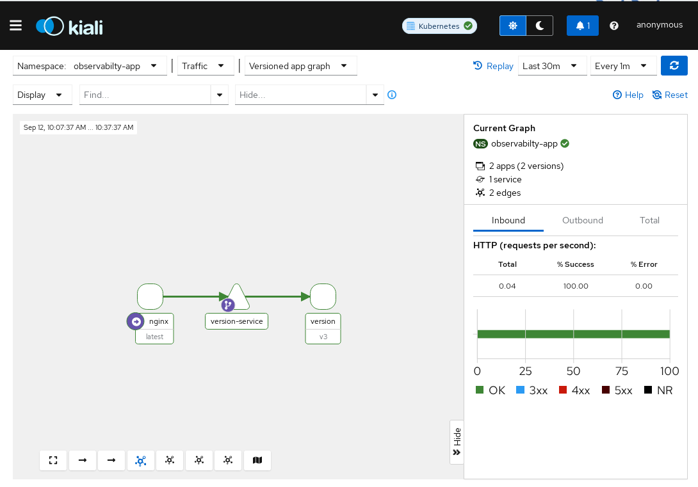
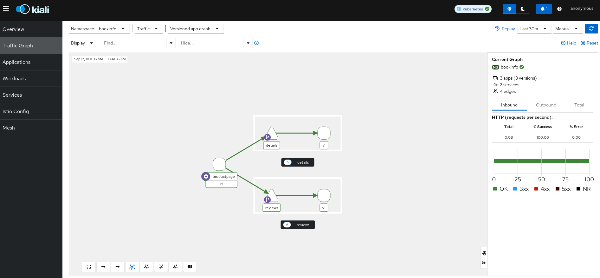
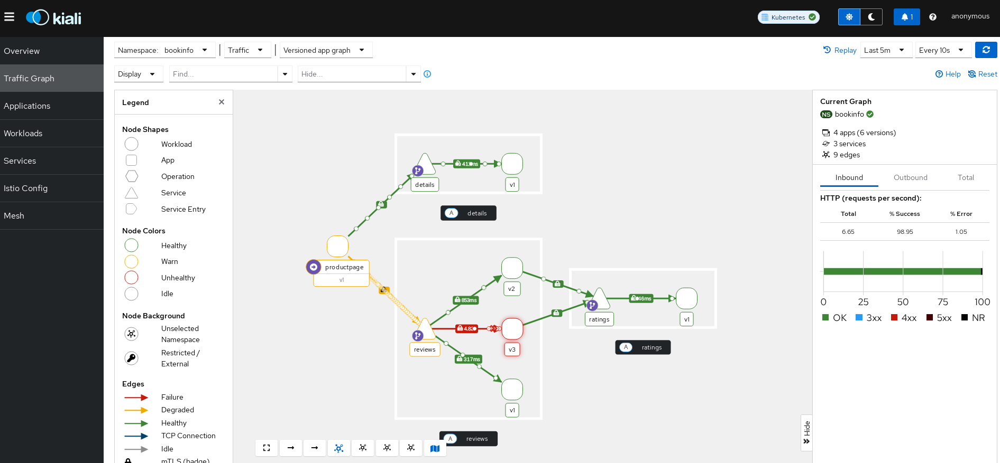
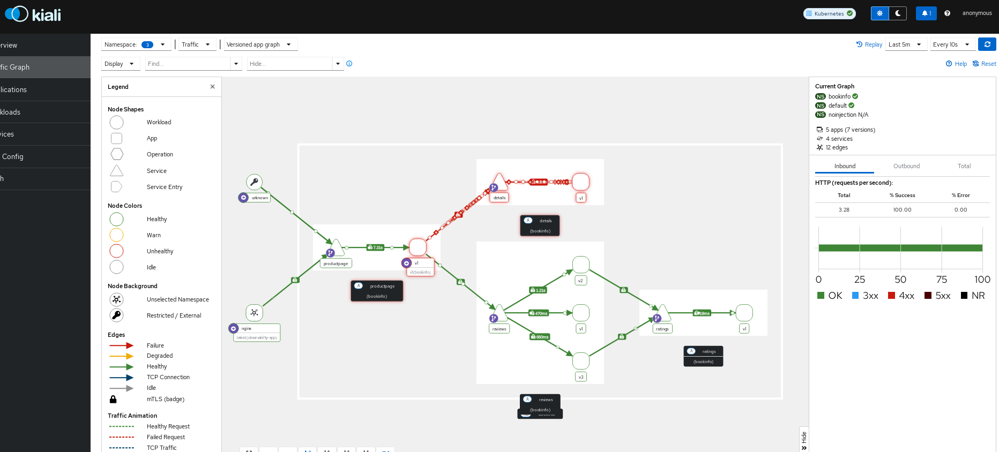
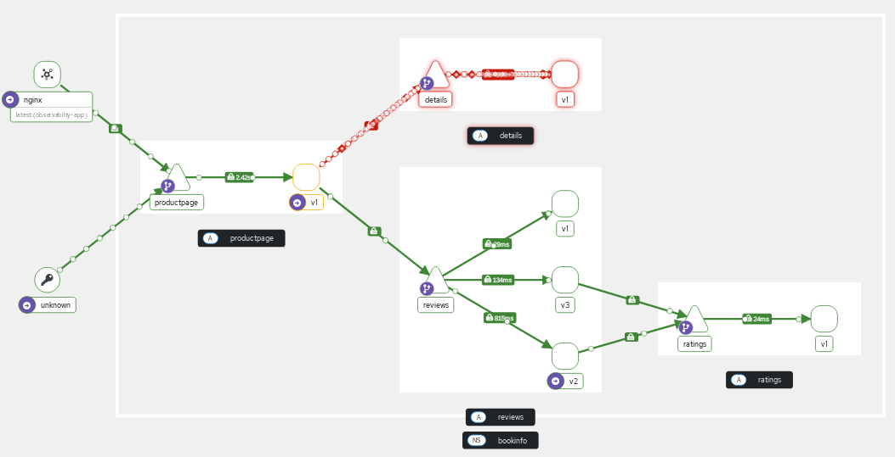
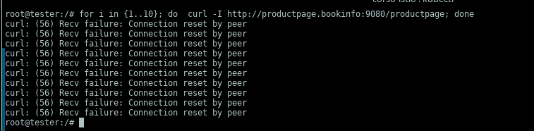
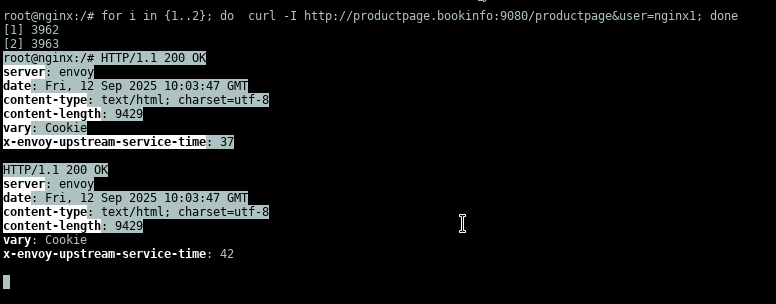
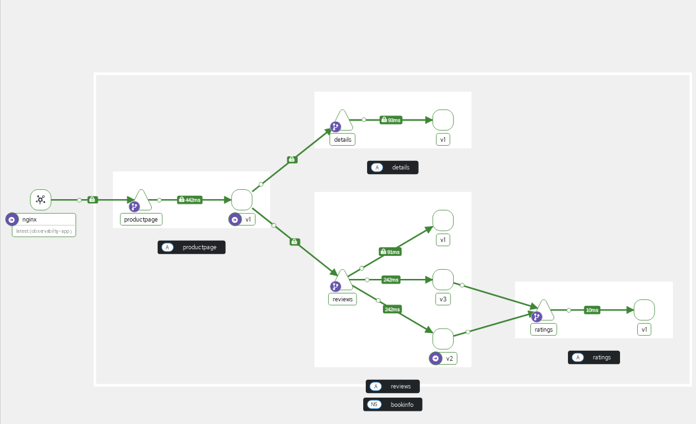
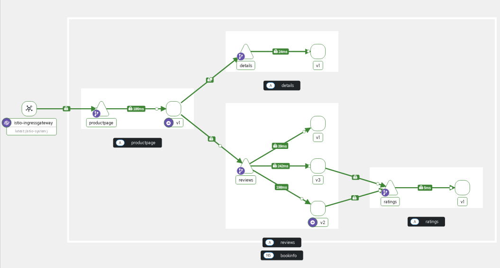

# Monitoring

## Prereq: installazione gateway-api e istio ambient

Script installazione automatico

```bash
curl -L https://istio.io/downloadIstio | ISTIO_VERSION=1.25.1 sh -
export PATH="$PATH:/root/istio-1.25.1/bin"
istioctl install --set profile=demo -y
kubectl label namespace default istio-injection=enabled
```

deploy observabilty stack su ns dedicato

```bash
ns=observabilty
kubectl create namespace ${ns}
kubectl label namespace ${ns} istio-injection=enabled
kubectl config set-context --current --namespace=${ns}

kubectl apply -f ../samples/addons/prometheus.yaml
kubectl apply -f ../samples/addons/grafana.yaml
kubectl apply -f ../samples/addons/kiali.yaml
kubectl apply -f ../samples/addons/jaeger.yaml
```

creiamo una applicazione

```bash
ns=observabilty-app
kubectl create namespace ${ns}
kubectl label namespace ${ns} istio-injection=enabled
kubectl config set-context --current --namespace=${ns}

kubectl apply -f ../B_Traffic_managment/3_canary_release/1_setupenv.yaml
kubectl apply -f ../B_Traffic_managment/3_canary_release/2_canary_release.yaml
```

creo pod per generare chiamate

```bash
kubectl run nginx --image=nginx
kubectl exec -it nginx -- bash
```

entro nel pod e genero le chiamate

```bash
for i in {1..10}; do curl -H "free-subscription: free" http://version-service/; echo; done;
for i in {1..10}; do curl -H "beta: tester" http://version-service/; echo; done;
for i in {1..10}; do curl http://version-service/; echo; done;
```

andiamo su kiali e vediamo un po la dashboard

```bash
kubectl port-forward --address 0.0.0.0 -n istio-system services/kiali 20001:20001
```



Deployamo bookinfo

```bash

ns=bookinfo
kubectl create namespace ${ns}
kubectl label namespace ${ns} istio-injection=enabled
kubectl config set-context --current --namespace=${ns}

kubectl apply -f samples/bookinfo/networking/virtual-service-all-v1.yaml
kubectl apply -f samples/bookinfo/networking/bookinfo-gateway.yaml
kubectl apply -f samples/bookinfo/networking/destination-rule-all.yaml
kubectl apply -f samples/bookinfo/platform/kube/bookinfo.yaml
kubectl wait deploy --all --for condition=available --timeout=400s

kubectl port-forward svc/productpage --address 0.0.0.0 9080:9080
```

facciamo dei giri sulla pagina productpage per i due user configurati



aggiungiamo la v1 al 70% e la v2 all'30% e la v3 al 10% (la destinationrule dovrebbe essere gia' con le 3 versioni)

```bash
kubectl patch virtualservice reviews --type merge -p '{
  "spec": {
    "http": [
      {
        "route": [
          {"destination": {"host": "reviews", "subset": "v1"}, "weight": 70},
          {"destination": {"host": "reviews", "subset": "v2"}, "weight": 30},
          {"destination": {"host": "reviews", "subset": "v3"}, "weight": 10}
        ]
      }
    ]
  }
}'
```

oppure

```bash
v1_weight=70
v2_weight=30
v3_weight=10

kubectl patch virtualservice reviews --type merge -p "{
  \"spec\": {
    \"http\": [
      {
        \"route\": [
          {\"destination\": {\"host\": \"reviews\", \"subset\": \"v1\"}, \"weight\": $v1_weight},
          {\"destination\": {\"host\": \"reviews\", \"subset\": \"v2\"}, \"weight\": $v2_weight},
          {\"destination\": {\"host\": \"reviews\", \"subset\": \"v3\"}, \"weight\": $v3_weight}
        ]
      }
    ]
  }
}"
```

## KIALI

browsiamo la productpage torniamo su kiali e vediamo il traffic distribution

generiamo carico con "**hey**" !!

```bash
# installa hey se non l'hai già (Linux)
# go install github.com/rakyll/hey@latest

urls=(
  "http://localhost:9080/"
  "http://localhost:9080/productpage?u=test"
  "http://localhost:9080/productpage?u=normal"
)

for url in "${urls[@]}"; do
  echo "Load test: $url"
  hey -z 30s -c 20 "$url" &
done

wait
```



creiamo un pod su namespace noinjection 

```bash
kubectl create ns noinjection
kubectl run tester --image=nginx -n noinjection 
kubectl exec -it tester -n noinjection -- bash
# curl -I http://productpage.bookinfo:9080/productpage
```

genero load verso la productpage

```bash
for i in {1..1000}; do  curl -I http://productpage.bookinfo:9080/productpage; done
```

Nota: ho generato lo stesso load nel pod di prima che era su observabilty-app

```bash
kubectl run nginx --image=nginx
kubectl exec -it nginx -n observabilty-app -- bash
for i in {1..1000}; do  curl -I http://productpage.bookinfo:9080/productpage; done
```

**NOTA** I due chiamanti arrivano in maniera diversa, in quanto observabilty-app è nel mesh


torniamo su kiali e abilitiamo il display security
tutte le connessioni hanno il lucchetto mTLS tranne quest'ultima (l'mtls non e stato messo a strict)





Controlliamo stato mtls

```bash
kubectl get peerauthentication -n istio-system
```

Abilito mtls a strict in modo da bloccare quella non in mesh

```bash
kubectl apply -f - <<EOF
apiVersion: security.istio.io/v1beta1
kind: PeerAuthentication
metadata:
  name: cluster-wide-mtls
  namespace: istio-system
spec:
  mtls:
    mode: STRICT
EOF

kubectl get peerauthentication -n istio-system
```

ora le chiamate mi falliranno dal pod su noinjection



quelle dal pod observabilty-app  corrette






vediamo del traffico dal ingressgateway

```bash
kubectl port-forward -n istio-system --address 0.0.0.0 service/istio-ingressgateway 1234:80
```

poi accedere dalla console alla 1234 ma su /productpage refreshare un po la pagina e tornare nella dashboard di kiali

```bash
for i in {1..1000}; do  curl -I http://localhost:1234/productpage; done
```




## GRAFANA

```bash
kubectl port-forward --address 0.0.0.0 -n istio-system services/grafana 3000:3000
```

## JAEGER

```bash
kubectl port-forward --address 0.0.0.0 -n istio-system svc/tracing 80:80
```
