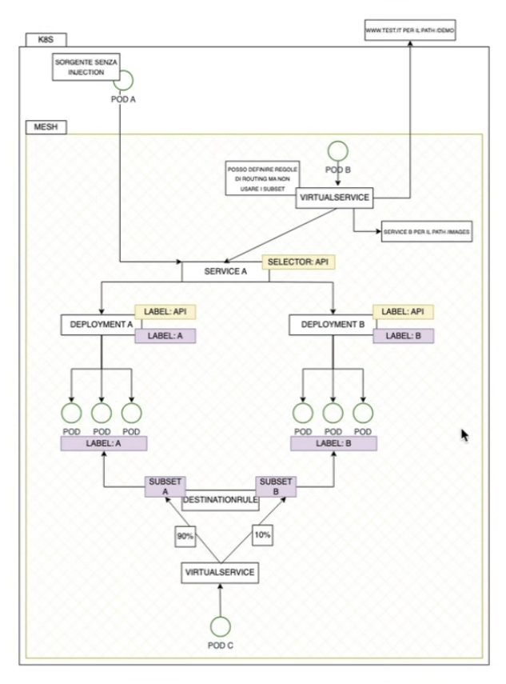

# APPUNTI DEL CORSO ISTIO

## setup

```bash
git clone https://github.com/alekonko/corso-istio.git
```

- setup su katacoda

```bash
curl -L https://istio.io/downloadIstio | ISTIO_VERSION=1.25.0 sh -
export PATH=$HOME/istio-1.25.0/bin:$PATH
```

- setup minikube (check cpu e ram, ram minima 8gb)

```bash
minikube start -p istio-ambient --driver=podman --container-runtime=containerd --addons=[metric-server,ingress,logviewer,yakd,registry-creds] --insecure-registry "dislexlinux.local:5000,dislexlinux:5000,192.168.0.0/16,10.0.0.0/8" --registry-mirror="http://dislexlinux.local:5000,http://dislexlinux:5000"  --cpus=4 --memory=12288mb --kubernetes-version=1.33.1
```

- installazione baseP

```bash
istioctl install --set profile=demo --skip-confirmation
```

- installazione ambient


```bash
# kubectl get crd gateways.gateway.networking.k8s.io &> /dev/null || kubectl apply -f https://github.com/kubernetes-sigs/gateway-api/releases/download/v1.3.0/standard-install.yaml

kubectl get crd gateways.gateway.networking.k8s.io &> /dev/null || kubectl apply -f manifests/gateway-api-1.3.0-install.yaml
istioctl install --set profile=ambient --skip-confirmation
```

- check installation

```bash
istioctl x precheck
```

- deploy di prova


```bash

```

## API PRINCIPALI

- **VirtualService** cattura il traffico in entrata e lo indirizza a una o più destinazioni.
- le destinazioni sono definite da una **DestinationRule**, che ne stabilisce le policy e le varianti (sottoinsiemi).
- nella destination roule i servizi si identificano con le loro label applicate ai service




Il campo host nel VirtualService specifica il nome del servizio a cui si applica la regola. Questo è tipicamente il nome del Service di Kubernetes (Service.metadata.name) o un nome DNS che risolve il servizio.
Il campo host nel DestinationRule specifica il nome del servizio su cui si opera, e deve corrispondere a quello del VirtualService.

Sia il **VirtualService** che il **DestinationRule** fanno riferimento allo stesso **Service** tramite il loro campo host. 
Il VirtualService definisce le regole di routing (subsets e percentuali di traffico), mentre il DestinationRule definisce i gruppi di pod disponibili (subsets) a cui il VirtualService può inviare il traffico.


- **serviceentry**


### Traffic Management: VIRTUAL SERVICE

**VirtualService**: È il "come". Un VirtualService definisce come instradare il traffico a un servizio specifico. Agisce come un router di alto livello, permettendoti di configurare regole di routing flessibili. Puoi usare un VirtualService per:

- Suddividere il traffico tra diverse versioni di un servizio (ad esempio, inviando il 90% del traffico a v1 e il 10% a v2).
- Eseguire il routing basato su header HTTP, URI o altri attributi del traffico.
- Gestire il timeout e i tentativi (retries) delle richieste.
- Impostare le politiche di connessione come circuit breaking o la sicurezza mTLS.


Qui sotto per esempio posso indirizzare su due servizi differenti in base ai match vari. posso usare anche applicazioni differenti.

Posso definire i sottoinsiemi (subsets) di un servizio, raggruppando istanze di pod in base a etichette (labels). Questi sottoinsiemi sono le destinazioni effettive a cui il VirtualService può inviare il traffico.

Il campo hosts elenca gli host a cui si applicano le regole di routing del VirtualService, può essere:

- Un IP 
- Un nome DNS 
- Un nome breve (es. servizio Kubemetes)

Può includere wildcard ($) per regole generiche. 

La sezione http permette di gestire:

- Condizioni di corrispondenza (match) 
- Azioni di routing (destinazione) 

il match puo essere: 
- URI: Path della richiesta 
- Method: GET, POST, ecc. 
- Authority: Host header 
- Scheme: http, https 
- Query Parameters: parametri URL 
- Headers: qualunque header HTTP 


```yaml
apiVersion: networking.istio.io/v1
kind: VirtualService
metadata:
  name: reviews-route
spec:
  hosts:
  - reviews.prod.svc.cluster.local
  http:
  - name: "reviews-v2-routes"
    match:
    - uri:
        prefix: "/wpcatalog"
    - uri:
        prefix: "/consumercatalog"
    rewrite:
      uri: "/newcatalog"
    route:
    - destination:
        host: reviews.prod.svc.cluster.local
        subset: v2
  - name: "reviews-v1-route"
    route:
    - destination:
        host: reviews.prod.svc.cluster.local
        subset: v1
```

- esempio per canary con header end-user jason, sotto c'e' la tr

```yaml
apiVersion: networking.istio.io/v1beta1
kind: VirtualService
metadata:
  name: reviews-canary
spec:
  hosts:
  - reviews
  http:
  - match:
    - headers:
        end-user:
          exact: jason
    route:
    - destination:
        host: reviews
        subset: v2
  - route:
    - destination:
        host: reviews
        subset: v1
```

### Traffic Management: DESTINATION RULE

    **DestinationRule**: È il "cosa". Una DestinationRule definisce la configurazione del traffico una volta che è stato instradato a una destinazione specifica. Se il VirtualService decide dove va il traffico, la DestinationRule ne definisce le proprietà e le policy. 
    
    Puoi usare una DestinationRule per:

    - Definire i sottoinsiemi (subsets) di un servizio, raggruppando istanze di pod in base a etichette (labels). Questi sottoinsiemi sono le destinazioni effettive a cui il VirtualService può inviare il traffico.
    - Configurare il load balancing (come round-robin o least-requests).
    - Impostare le politiche di connessione come circuit breaking o la sicurezza mTLS.


```yaml
apiVersion: networking.istio.io/v1beta1
kind: DestinationRule
metadata:
  name: reviews-dest-rule
spec:
  host: reviews.prod.svc.cluster.local
  subsets:
  - name: v1
    labels:
      version: v1
    trafficPolicy:
      loadBalancer:
        simple: ROUND_ROBIN
  - name: v2
    labels:
      version: v2
    trafficPolicy:
      loadBalancer:
        simple: LEAST_CONN
```


### SERVICE ENTRY


```yaml
apiVersion: networking.istio.io/v1beta1
kind: ServiceEntry
metadata:
  name: external-api
spec:
  hosts:
  - api.example.com
  ports:
  - number: 443
    name: https
    protocol: HTTPS
  location: MESH_EXTERNAL
  resolution: DNS
```

### GATEWAY


## ESERCIZI CUSTOM

- **B_Traffic_managment/1_traffic_shifting** setup bookinfo con ambient (c'e' gateway api) [minikube_conco_ambient B_Traffic_managment/1_traffic_shifting/readme-conco.md](B_Traffic_managment/1_traffic_shifting/readme-conco.md)
- **B_Traffic_managment/2_traffic_mirror** sempre con ambient [minikube_conco_ambient B_Traffic_managment/1_traffic_shifting/readme-conco.md](B_Traffic_managment/2_traffic_mirror/readme-conco.md)


## COMANDI UTILI: istioctl proxy-status

- `istioctl proxy-status` fornisce una panoramica dello stato di sincronizzazione tra control plane di Istio (Istiod) e i vari proxy sidecar (Envoy) in esecuzione nei pod

esempio (questo cluster k8s ha sia istio ambient e istio sidecar installation)

```bash
NAME                                      CLUSTER        ISTIOD                      VERSION     SUBSCRIBED TYPES
test-556b4dcc6c-9n84g.default             Kubernetes     istiod-796c54b8bb-9dsjw     1.27.0      4 (CDS,LDS,EDS,RDS)
test-sidecar-6f46c69d85-bj5h6.default     Kubernetes     istiod-796c54b8bb-9dsjw     1.27.0      5 (CDS,LDS,EDS,RDS,WDS)
ztunnel-ldkz6.istio-system                Kubernetes     istiod-796c54b8bb-9dsjw     1.27.0      2 (WADS,WDS)
```

1. `NAME`  indica il **proxy sidecar** di cui si sta visualizzando lo stato. Il formato è `<nome-pod>.<namespace>`
2. `CLUSTER` indica il cluster Kubernetes a cui appartiene il proxy
3. `ISTIOD` è l'identificativo del **pod Istiod** a cui il proxy si è connesso per ricevere la sua configurazione. `istiod-796c54b8bb-9dsjw` mostra che entrambi i proxy stanno ricevendo la configurazione dallo stesso control plane
4. `VERSION`  **versione di Istio** del proxy. 
5. `SUBSCRIBED TYPES`  Mostra i tipi di configurazione che il proxy sta ricevendo dal piano di controllo tramite il protocollo **xDS (Discovery Service)**. I numeri tra parentesi indicano quanti tipi di risorse sono stati sincronizzati. 

Tipi risorse

* **`CDS` (Cluster Discovery Service)**: Contiene informazioni sui cluster di destinazione. Un cluster è un gruppo di endpoint di rete a cui il proxy può inviare il traffico.
* **`LDS` (Listener Discovery Service)**: Descrive i listener del proxy, ovvero le porte e i protocolli su cui il proxy accetta il traffico in entrata.
* **`EDS` (Endpoint Discovery Service)**: Fornisce l'elenco degli endpoint effettivi (indirizzi IP e porte) per ogni cluster, consentendo al proxy di sapere dove inviare il traffico.
* **`RDS` (Route Discovery Service)**: Contiene le regole di routing che mappano le richieste in entrata (da un listener) a un cluster di destinazione.

 `test-556b4dcc6c-9n84g.default` mostra che il proxy ha sincronizzato tutti i tipi di configurazione principali per la gestione del traffico.

 `ztunnel-ldkz6.istio-system` mostra un caso particolare. `ztunnel` è il componente di Istio che si occupa del traffico mTLS (mutual TLS) a livello di rete, noto anche come Istio Ambient Mesh. I tipi `WADS` (Waypoint Agent Discovery Service) e `WDS` (Waypoint Discovery Service) sono specifici di questa architettura e indicano che il `ztunnel` sta sincronizzando la configurazione relativa a un **waypoint proxy**, un concetto chiave della modalità Ambient Mesh.

