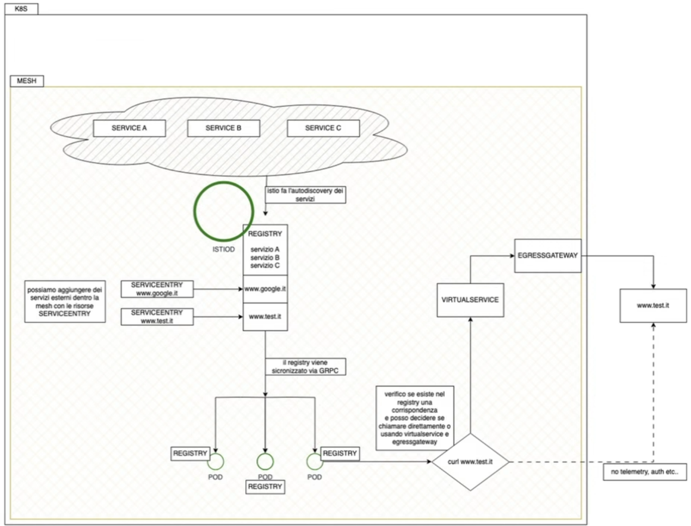

# APPUNTI DEL CORSO ISTIO

## setup

```bash
git clone https://github.com/alekonko/corso-istio.git
```

- setup su katacoda

```bash
curl -L https://istio.io/downloadIstio | ISTIO_VERSION=1.25.0 sh -
export PATH=$HOME/istio-1.25.0/bin:$PATH
```

- setup minikube (check cpu e ram, ram minima 8gb)

```bash
minikube start -p istio-ambient --driver=podman --container-runtime=containerd --addons=[metric-server,ingress,logviewer,yakd,registry-creds] --insecure-registry "dislexlinux.local:5000,dislexlinux:5000,192.168.0.0/16,10.0.0.0/8" --registry-mirror="http://dislexlinux.local:5000,http://dislexlinux:5000"  --cpus=4 --memory=12288mb --kubernetes-version=1.33.1
```

- installazione baseP

```bash
istioctl install --set profile=demo --skip-confirmation
```

- installazione ambient


```bash
# kubectl get crd gateways.gateway.networking.k8s.io &> /dev/null || kubectl apply -f https://github.com/kubernetes-sigs/gateway-api/releases/download/v1.3.0/standard-install.yaml

kubectl get crd gateways.gateway.networking.k8s.io &> /dev/null || kubectl apply -f manifests/gateway-api-1.3.0-install.yaml
istioctl install --set profile=ambient --skip-confirmation
```

- check installation

```bash
istioctl x precheck
```

- deploy di prova


```bash

```

## API PRINCIPALI

- **VirtualService** cattura il traffico in entrata e lo indirizza a una o più destinazioni.
- le destinazioni sono definite da una **DestinationRule**, che ne stabilisce le policy e le varianti (sottoinsiemi).
- nella destination roule i servizi si identificano con le loro label applicate ai service


Il campo host nel VirtualService specifica il nome del servizio a cui si applica la regola. Questo è tipicamente il nome del Service di Kubernetes (Service.metadata.name) o un nome DNS che risolve il servizio.
Il campo host nel DestinationRule specifica il nome del servizio su cui si opera, e deve corrispondere a quello del VirtualService.

Sia il **VirtualService** che il **DestinationRule** fanno riferimento allo stesso **Service** tramite il loro campo host. 
Il VirtualService definisce le regole di routing (subsets e percentuali di traffico), mentre il DestinationRule definisce i gruppi di pod disponibili (subsets) a cui il VirtualService può inviare il traffico.


- **serviceentry**


### Traffic Management: VIRTUAL SERVICE

**VirtualService**: È il "come". Un VirtualService definisce come instradare il traffico a un servizio specifico. Agisce come un router di alto livello, permettendoti di configurare regole di routing flessibili. Puoi usare un VirtualService per:

- Suddividere il traffico tra diverse versioni di un servizio (ad esempio, inviando il 90% del traffico a v1 e il 10% a v2).
- Eseguire il routing basato su header HTTP, URI o altri attributi del traffico.
- Gestire il timeout e i tentativi (retries) delle richieste.
- Impostare le politiche di connessione come circuit breaking o la sicurezza mTLS.


Qui sotto per esempio posso indirizzare su due servizi differenti in base ai match vari. posso usare anche applicazioni differenti.

Posso definire i sottoinsiemi (subsets) di un servizio, raggruppando istanze di pod in base a etichette (labels). Questi sottoinsiemi sono le destinazioni effettive a cui il VirtualService può inviare il traffico.

Il campo hosts elenca gli host a cui si applicano le regole di routing del VirtualService, può essere:

- Un IP 
- Un nome DNS 
- Un nome breve (es. servizio Kubemetes)

Può includere wildcard ($) per regole generiche. 

La sezione http permette di gestire:

- Condizioni di corrispondenza (match) 
- Azioni di routing (destinazione) 

il match puo essere: 
- URI: Path della richiesta 
- Method: GET, POST, ecc. 
- Authority: Host header 
- Scheme: http, https 
- Query Parameters: parametri URL 
- Headers: qualunque header HTTP 


```yaml
apiVersion: networking.istio.io/v1
kind: VirtualService
metadata:
  name: reviews-route
spec:
  hosts:
  - reviews.prod.svc.cluster.local
  http:
  - name: "reviews-v2-routes"
    match:
    - uri:
        prefix: "/wpcatalog"
    - uri:
        prefix: "/consumercatalog"
    rewrite:
      uri: "/newcatalog"
    route:
    - destination:
        host: reviews.prod.svc.cluster.local
        subset: v2
  - name: "reviews-v1-route"
    route:
    - destination:
        host: reviews.prod.svc.cluster.local
        subset: v1
```

- esempio per canary con header end-user jason, sotto c'e' la tr

```yaml
apiVersion: networking.istio.io/v1beta1
kind: VirtualService
metadata:
  name: reviews-canary
spec:
  hosts:
  - reviews
  http:
  - match:
    - headers:
        end-user:
          exact: jason
    route:
    - destination:
        host: reviews
        subset: v2
  - route:
    - destination:
        host: reviews
        subset: v1
```

### Traffic Management: DESTINATION RULE

    **DestinationRule**: È il "cosa". Una DestinationRule definisce la configurazione del traffico una volta che è stato instradato a una destinazione specifica. Se il VirtualService decide dove va il traffico, la DestinationRule ne definisce le proprietà e le policy. 
    
    Puoi usare una DestinationRule per:

    - Definire i sottoinsiemi (subsets) di un servizio, raggruppando istanze di pod in base a etichette (labels). Questi sottoinsiemi sono le destinazioni effettive a cui il VirtualService può inviare il traffico.
    - Configurare il load balancing (come round-robin o least-requests).
    - Impostare le politiche di connessione come circuit breaking o la sicurezza mTLS.


```yaml
apiVersion: networking.istio.io/v1beta1
kind: DestinationRule
metadata:
  name: reviews-dest-rule
spec:
  host: reviews.prod.svc.cluster.local
  subsets:
  - name: v1
    labels:
      version: v1
    trafficPolicy:
      loadBalancer:
        simple: ROUND_ROBIN
  - name: v2
    labels:
      version: v2
    trafficPolicy:
      loadBalancer:
        simple: LEAST_CONN
```


### SERVICE ENTRY


```yaml
apiVersion: networking.istio.io/v1beta1
kind: ServiceEntry
metadata:
  name: external-api
spec:
  hosts:
  - api.example.com
  ports:
  - number: 443
    name: https
    protocol: HTTPS
  location: MESH_EXTERNAL
  resolution: DNS
```

### GATEWAY




Gateway describes a load balancer operating at the edge of the mesh receiving incoming or outgoing HTTP/TCP connections. The specification describes a set of ports that should be exposed, the type of protocol to use, SNI configuration for the load balancer, etc.

For example, the following Gateway configuration sets up a proxy to act as a load balancer exposing port 80 and 9080 (http), 443 (https), 9443(https) and port 2379 (TCP) for ingress. The gateway will be applied to the proxy running on a pod with labels app: my-gateway-controller. While Istio will configure the proxy to listen on these ports, it is the responsibility of the user to ensure that external traffic to these ports are allowed into the mesh.

```yaml
apiVersion: networking.istio.io/v1
kind: Gateway
metadata:
  name: my-gateway
  namespace: some-config-namespace
spec:
  selector:
    app: my-gateway-controller
  servers:
  - port:
      number: 80
      name: http
      protocol: HTTP
    hosts:
    - uk.bookinfo.com
    - eu.bookinfo.com
    tls:
      httpsRedirect: true # sends 301 redirect for http requests
  - port:
      number: 443
      name: https-443
      protocol: HTTPS
    hosts:
    - uk.bookinfo.com
    - eu.bookinfo.com
    tls:
      mode: SIMPLE # enables HTTPS on this port
      serverCertificate: /etc/certs/servercert.pem
      privateKey: /etc/certs/privatekey.pem
  - port:
      number: 9443
      name: https-9443
      protocol: HTTPS
    hosts:
    - "bookinfo-namespace/*.bookinfo.com"
    tls:
      mode: SIMPLE # enables HTTPS on this port
      credentialName: bookinfo-secret # fetches certs from Kubernetes secret
  - port:
      number: 9080
      name: http-wildcard
      protocol: HTTP
    hosts:
    - "*"
  - port:
      number: 2379 # to expose internal service via external port 2379
      name: mongo
      protocol: MONGO
    hosts:
    - "*"
```


La risorsa Gateway configura il proxy Envoy come bilanciatore di carico, esponendo la porta 80 per l'ingresso. 
La configurazione del gateway viene applicata al proxy dell'ingress gateway con l'etichetta istio: ingressgateway. 


Il campo hosts fa da filtro e lascerà passare solo il traffico destinato a booking.example.com 

```yaml
apiVersion: networking.istio.io/v1alpha3
kind: Gateway
metadata:
  name: booking-gateway
spec:
  selector:
    istio: ingressgateway
  servers:
  - name: booking
    port:
      number: 80
      name: http
      protocol: HTTP
    hosts:
    - "booking.example.com"
```

- INBOUND

Per controllare e inoltrare il traffico a un effettivo servizio Kubernetes in esecuzione all'interno del cluster, dobbiamo 
configurare un VirtualService con nomi host corrispondenti (booking.example.com) e quindi collegarvi la risorsa Gateway


- OUTBOUND

Oltre al gateway di ingresso, possiamo implementare un gateway di uscita per 
controllare e filtrare il traffico in uscita dalla nostra rete mesh. 


Possiamo utilizzare la stessa risorsa Gateway per configurare il gateway di uscita come 
abbiamo configurato il gateway di ingresso. 

II gateway di uscita ci consente di centralizzare tutto il traffico in uscita, la registrazione e l'autorizzazione. 
istio ha una policy outboundTrafficPoIicy che puo avere due valori REGISTRY_ONLY o ALLOW ANY 

se impostata a registry only blocchera tutte le richieste ad host che non sono definite nel registro di istio. 

per aggiungere un servizio esterno al registry dobbiamo definire una ServiceEntry
dopo aver abilitato la comunicazione, dobbiamo far passare il traffico attraverso l'egress gateway, 

Io facciamo definendo un gateway con il selector egressgateway  e infine dobbiamo definire un virtualservice che avra come endpoint il gateway 

Utilizzare l'egress gateway è particolarmente utile quando si desidera: 

- Applicare politiche di sicurezza al traffico in uscita. 
- Monitorare o registrare il traffico verso servizi esterni. 
- Applicare ratelimit retry e cirtcuit breacker
REGITRY_ONLY  permette di bloccare tutte le chiamate esterne che non son presente in istio.se sono esterne  devo creare le service entry  necessarie

posso impostare outboundpolicy-registry-only come default


### GATEWAY CON AMBIENT

An ambient mesh is logically split into a data plane and a control plane.

    The data plane is composed of a set of programmable proxy servers, also referred to as ztunnels and waypoint proxies. These proxies mediate and control all network communication, and collect and report telemetry on all mesh traffic. Compared to traditional service mesh architectures, where the proxy servers are deployed as “sidecars” next to every workload, ambient mesh uses proxy servers that are operated by the cluster administrator.

    The control plane manages and configures the proxies in the data plane.


[ambientmesh.io: sidecar-migration-part-4](https://ambientmesh.io/blog/sidecar-migration-part-4/#configuration)

Because of the opportunity afforded by a major change to Istio, the maintainers decided that Gateway API would be the sole API supported for waypoints within an ambient mesh. 

**Instead of using VirtualService, you should use HTTPRoute** (and its siblings). There are some exceptions

Gateway API is a “lowest common denominator” API, and some features of Istio cannot yet be described using it. 
The legacy VirtualService API is still required for some tasks when configuring routing through waypoints. 
You can mix the two within the mesh, but not for the same host. 
If you have a VirtualService defined for a hostname and you create one or more HTTPRoutes, the VirtualService will be overwritten and its rules will not be implemented.
Any use of VirtualService with waypoints is currently marked as Alpha in upstream Istio; that effectively means that the maintainers believe it works, but haven’t stringently tested it.

**Nota:** Con ambient devo utilizzare gateway (ed http route) fornite da gateway api e non quelle di istio

```yaml
apiVersion: gateway.networking.k8s.io/v1
kind: Gateway
metadata:
  name: bookinfo-gateway
spec:
  gatewayClassName: istio
  listeners:
  - name: http
    port: 80
    protocol: HTTP
    allowedRoutes:
      namespaces:
        from: Same
---
apiVersion: gateway.networking.k8s.io/v1
kind: HTTPRoute
metadata:
  name: bookinfo
spec:
  parentRefs:
  - name: bookinfo-gateway
  rules:
  - matches:
    - path:
        type: Exact
        value: /productpage
    - path:
        type: PathPrefix
        value: /static
    - path:
        type: Exact
        value: /login
    - path:
        type: Exact
        value: /logout
    - path:
        type: PathPrefix
        value: /api/v1/products
    backendRefs:
    - name: productpage
      port: 9080
```

[setup gateway-api-1.3.0](/home/u357595/gitrepo/github/alekonko/corso-istio/manifests/gateway-api-1.3.0-install.yaml)
[esempio di bookinfo](samples/bookinfo/gateway-api/bookinfo-gateway.yaml)


## ESERCIZI CUSTOM

- **B_Traffic_managment/1_traffic_shifting** setup bookinfo con ambient (c'e' gateway api) [minikube_conco_ambient B_Traffic_managment/1_traffic_shifting/readme-conco.md](B_Traffic_managment/1_traffic_shifting/readme-conco.md)
- **B_Traffic_managment/2_traffic_mirror** [minikube_conco_ambient B_Traffic_managment/2_traffic_mirror/readme-conco.md](B_Traffic_managment/2_traffic_mirror/readme-conco.md) esempio da round robin a mirroring su secondo pod fatto da istio, ambient indifferente (uso pod interno per test)
- **B_Traffic_managment/3_canary_release** [minikube_conco_ambient B_Traffic_managment/3_canary_release/readme-conco.md](B_Traffic_managment/3_canary_release/readme-conco.md):   canary su 3 versioni su base header, ambient indifferente (uso pod interno per test)
- **B_Traffic_managment/4_canary_release_PAE**  Canary 2 - da query parameters [minikube_conco_ambient B_Traffic_managment/4_canary_release_PAE/readme-conco.md](B_Traffic_managment/4_canary_release_PAE/readme-conco.md):
- **ANCORA DA FARE**  **C_circuit_breaker/readme-conco.md** [C_circuit_breaker/readme-conco.md](C_circuit_breaker/readme-conco.md) da fare
- **D_Gateway/1_ingress/readme-conco.md** setup con ingress gw su killercoda [D_Gateway/1_ingress/readme-conco.md](D_Gateway/1_ingress/readme-conco.md)
- INCORSO **D2_Gateway_Ambient_conco/1_conco/readme-conco.md**  [D2_Gateway_Ambient_conco/1_conco/readme-conco.md](D2_Gateway_Ambient_conco/1_conco/readme-conco.md) sto creando esempio funzionante per usare ambient. funzionante questo preso da istio bookinfo, [minikube_conco_ambient B_Traffic_managment/1_traffic_shifting/readme-conco.md](B_Traffic_managment/1_traffic_shifting/readme-conco.md)

## COMANDI UTILI: istioctl proxy-status

- `istioctl proxy-status` fornisce una panoramica dello stato di sincronizzazione tra control plane di Istio (Istiod) e i vari proxy sidecar (Envoy) in esecuzione nei pod

esempio (questo cluster k8s ha sia istio ambient e istio sidecar installation)

```bash
NAME                                      CLUSTER        ISTIOD                      VERSION     SUBSCRIBED TYPES
test-556b4dcc6c-9n84g.default             Kubernetes     istiod-796c54b8bb-9dsjw     1.27.0      4 (CDS,LDS,EDS,RDS)
test-sidecar-6f46c69d85-bj5h6.default     Kubernetes     istiod-796c54b8bb-9dsjw     1.27.0      5 (CDS,LDS,EDS,RDS,WDS)
ztunnel-ldkz6.istio-system                Kubernetes     istiod-796c54b8bb-9dsjw     1.27.0      2 (WADS,WDS)
```

1. `NAME`  indica il **proxy sidecar** di cui si sta visualizzando lo stato. Il formato è `<nome-pod>.<namespace>`
2. `CLUSTER` indica il cluster Kubernetes a cui appartiene il proxy
3. `ISTIOD` è l'identificativo del **pod Istiod** a cui il proxy si è connesso per ricevere la sua configurazione. `istiod-796c54b8bb-9dsjw` mostra che entrambi i proxy stanno ricevendo la configurazione dallo stesso control plane
4. `VERSION`  **versione di Istio** del proxy. 
5. `SUBSCRIBED TYPES`  Mostra i tipi di configurazione che il proxy sta ricevendo dal piano di controllo tramite il protocollo **xDS (Discovery Service)**. I numeri tra parentesi indicano quanti tipi di risorse sono stati sincronizzati. 

Tipi risorse

* **`CDS` (Cluster Discovery Service)**: Contiene informazioni sui cluster di destinazione. Un cluster è un gruppo di endpoint di rete a cui il proxy può inviare il traffico.
* **`LDS` (Listener Discovery Service)**: Descrive i listener del proxy, ovvero le porte e i protocolli su cui il proxy accetta il traffico in entrata.
* **`EDS` (Endpoint Discovery Service)**: Fornisce l'elenco degli endpoint effettivi (indirizzi IP e porte) per ogni cluster, consentendo al proxy di sapere dove inviare il traffico.
* **`RDS` (Route Discovery Service)**: Contiene le regole di routing che mappano le richieste in entrata (da un listener) a un cluster di destinazione.

 `test-556b4dcc6c-9n84g.default` mostra che il proxy ha sincronizzato tutti i tipi di configurazione principali per la gestione del traffico.

 `ztunnel-ldkz6.istio-system` mostra un caso particolare. `ztunnel` è il componente di Istio che si occupa del traffico mTLS (mutual TLS) a livello di rete, noto anche come Istio Ambient Mesh. I tipi `WADS` (Waypoint Agent Discovery Service) e `WDS` (Waypoint Discovery Service) sono specifici di questa architettura e indicano che il `ztunnel` sta sincronizzando la configurazione relativa a un **waypoint proxy**, un concetto chiave della modalità Ambient Mesh.

